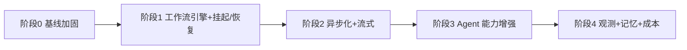

# V2 实现步骤计划

> 依据 [v2-roadmap.md](../v2-roadmap.md) 拆分,将 V2 主题落地为可执行、可验收的步骤序列。
> 状态:草案
> 制定日期:2026-08-13

## 总览

按 roadmap 的推进顺序,V2 拆成 5 个阶段、18 个步骤。每个步骤给出「目标 / 主要改动 / 验收标准」,验收标准包含测试要求(呼应 roadmap 的横切关注点)。

- 阶段 0 是前置,先补测试与轻量 trace,为后续重构兜底。
- 阶段 1 完成前,阶段 2 的审批异步、阶段 3 的 ReAct 都无法安全落地。
- 阶段 4 的完整 trace UI 依赖阶段 2/3 的 span 数据完整性。

## 阶段 0:基线加固(测试护栏 + 轻量可观测性)

目标:在动架构前,先建立可回归的测试基线和最小可观测性,避免 V2 重构「边改边崩」。

### Step 0.1 建立测试基线

- 目标:为 sequence 并发、审批挂起/恢复、DAG 拓扑、流式断线、ReAct 轮次预留测试结构。
- 主要改动:
    - 在 `backend/tests/` 新增 `test_eventing.py`,覆盖 `append_event` 的 sequence 递增与并发插入竞态。
    - 补齐现有 `SequentialWorkflow` 的端到端回归测试(用 mock LLM),作为重构的「行为不变」护栏。
    - 前端补组件测试,当前仅 1 个 `StatusBadge` 测试,至少补齐 `RunTimeline`、`ArtifactViewer` 的渲染测试。
- 验收:后端 pytest、前端 vitest 全绿;并发插入同一 run 的 sequence 测试能复现当前竞态(先红后绿)。

### Step 0.2 失败归因分类

- 目标:把「所有错误都进 error_message」改成结构化错误码,为后续可观测性与熔断打底。
- 主要改动:
    - 在 `app/core/errors.py` 定义错误分类:`LLM_TIMEOUT / LLM_JSON_PARSE / TOOL_FAILED / TOOL_APPROVAL_TIMEOUT / RUN_CANCELLED / BUDGET_EXCEEDED / UNKNOWN`。
    - `run_worker.execute_run` 与 `workflows/sequential.py` 捕获异常时写入分类码,而不是只写 `str(exc)`。
    - `Run.error_message` 保持不变,新增 `error_code` 字段(或先写入 `metadata_`)。
- 验收:失败 run 能被分类统计;新增单测覆盖每个分类分支。

### Step 0.3 轻量 span 记录(LLM 调用级)

- 目标:先落地最小 span,让每次 LLM 调用可被追踪,为 DAG/ReAct 提供调试底座。
- 主要改动:
    - 定义 span 概念:`run_id → step_id → agent_id → llm_call`。
    - 在 `BaseAgent.run` 调用 LLM 处,由 workflow 记录一次 llm_call span(可先复用 RunEvent,或新增轻量 `spans` 表)。
    - 记录字段:model、input/output tokens、latency、status、error_code。
- 验收:任意一次 run 能看到每个 Agent 的 LLM 调用耗时与 token 用量;失败调用带 error_code。

## 阶段 1:工作流引擎化 + 挂起/恢复(主题 A)

目标:拆掉 `SequentialWorkflow` 的硬编码,建立可配置 DAG 与「暂停—恢复」原语。

### Step 1.1 Workflow 抽象与注册表

- 目标:让 worker 按 `workflow_name` 选择实现,不再直接 import。
- 主要改动:
    - 定义 `Workflow` 基类/协议:`execute(db, run)`、`resume(db, run)`、`cancel(db, run)`。
    - 新建 `app/workflows/registry.py`,维护 `name → Workflow 类` 映射,提供 `register()` / `get()`。
    - `app/workers/run_worker.py` 改为 `get_registry().get(run.workflow_name)`。
    - 把现有 `SequentialWorkflow` 注册为 `sequential_report`。
- 验收:加一个新 workflow = 新增文件 + 注册一行;`run.workflow_name` 字段被真正消费。

### Step 1.2 DAG 编排器与 step 依赖

- 目标:把拓扑、取消检查、事件写入、产物生成从 `execute` 里分离。
- 主要改动:
    - 定义节点模型:step id、agent、依赖(替代 `previous` dict 的隐式约定)、条件路由(pass/fail 分支)。
    - 实现 DAG 拓扑排序 + 并行分支执行(如 Planner 后并行两个 Researcher)。
    - 把 `SequentialWorkflow` 迁移到 DAG 编排器上,行为保持不变(用 Step 0.1 的回归测试验证)。
- 验收:并行分支能真实并发;`SequentialWorkflow` 迁移后回归测试全绿。

### Step 1.3 挂起/恢复(checkpoint/resume)

- 目标:提供「暂停—恢复」原语,作为审批、取消、重试的共同底座。
- 主要改动:
    - 定义 checkpoint:已完成的 step 序列、当前 step、恢复所需的上下文快照。
    - 实现 `resume`:从 checkpoint 继续,不重复执行已完成 step。
    - 把 `ToolRunner` 的审批等待改造为「挂起」而非 `time.sleep`(先保留同步语义,真正异步化在阶段 2)。
- 验收:任意 step 边界可暂停并恢复;恢复后不重复执行已完成 step(用副作用计数测试验证)。

### Step 1.4 per-step 重试与工具幂等

- 目标:把「整个 run 重试」细化到 per-step,并保证副作用安全。
- 主要改动:
    - 定义 per-step retry 策略(次数、退避、可重试错误)。
    - 为工具调用引入幂等键(`idempotency_key`),`send_notification` 等副作用工具执行前查重。
    - 重试时跳过已成功的 step/tool_call。
- 验收:注入可重试错误时仅重试该 step;副作用工具重复触发时只真正执行一次。

## 阶段 2:异步化 + 流式(主题 B)

目标:解决「审批卡 worker」与「看不到逐字输出」两个体验问题。

### Step 2.1 审批异步化

- 目标:审批期间不占用 worker。
- 主要改动:
    - 基于 Step 1.3 的挂起/恢复,审批等待改为「释放 worker + 记录 checkpoint」。
    - 用 PG `LISTEN/NOTIFY` 或 RQ `enqueue_at` 在审批回调后重新入队 resume。
    - 删除 `runner.py` 里的 `time.sleep` 轮询。
- 验收:审批中的 run 不占用 worker;审批回来能正确续跑、不重复执行已完成 step。

### Step 2.2 事件 sequence 并发安全

- 目标:消除 `SELECT MAX(sequence)+1` 的竞态。
- 主要改动:
    - 给 `run_events` 加唯一约束 `(run_id, sequence)`。
    - `append_event` 改为由数据库保证顺序(per-run 序列或 `ON CONFLICT` 递增重试)。
- 验收:并发写入同一 run 不撞 sequence;新增并发测试覆盖。

### Step 2.3 token 流式与 SSE 断线重连

- 目标:前端能看到 Writer 逐字输出。
- 主要改动:
    - `LLMProvider.chat` 增加 `stream=True`,产出 token 增量。
    - `Agent.run` 支持流式回调,把 token 作为事件增量推送。
    - 前端 `useRunEvents` 支持 `token` 事件累积渲染;SSE 断线重连带 `Last-Event-ID`。
- 验收:前端能看到逐字输出;断线重连不丢 token/事件。

### Step 2.4 SSE 推送 pub/sub 化

- 目标:把事件推送从 DB 轮询升级为 pub/sub。
- 主要改动:
    - `app/services/event_service.py` 的 `stream` 从「每 0.5s 查库」改为订阅 Redis pub/sub。
    - 事件写入 `append_event` 后同步 publish。
- 验收:事件延迟显著下降;多订阅者并发不丢事件。

## 阶段 3:Agent 能力增强(主题 C)

目标:让 Agent 具备多轮工具调用与可配置能力。

### Step 3.1 ReAct 循环

- 目标:Agent 内部「思考→工具→观察→再思考」多轮,而非单次声明。
- 主要改动:
    - `BaseAgent.run` 支持 tool loop:声明工具 → 经 ToolRunner 执行 → 观察结果 → 决定继续或结束。
    - 加入轮次上限与显式终止条件。
    - 用 `ResearcherAgent` 演示连续多次工具调用。
- 验收:Researcher 能在一次 run 内连续调用多个工具;轮次上限生效。

### Step 3.2 Agent 间消息传递(message bus)

- 目标:替代 `previous` dict 的隐式依赖。
- 主要改动:
    - 引入显式 message bus,Agent 可发布/订阅上游消息。
    - 迁移 `WriterAgent`/`ReviewerAgent` 从 `ctx.previous` 读取改为订阅。
- 验收:上游输出经 bus 传递;移除对 `previous` dict 的直接访问。

### Step 3.3 Agent 配置化与工具动态注册

- 目标:system_prompt/model/temperature 与工具从配置/DB 读取。
- 主要改动:
    - Agent 配置从 `config.py` 或 DB 读,不写死在类里。
    - 工具注册支持从 DB/配置加载,不重启服务。
    - 明确「行为逻辑仍需代码」的边界(见 roadmap 北极星指标)。
- 验收:改配置即可换 model/temperature;新增工具不需改代码重启。

## 阶段 4:可观测性 + 记忆 + 成本治理(主题 D)

目标:规模化后能看清慢/贵/错,并能复用历史。

### Step 4.1 完整 trace UI

- 目标:前端展示完整调用树。
- 主要改动:
    - 基于阶段 0/2 的 span 数据,前端新增 trace 树视图(run → step → agent → llm_call)。
    - 展示每段耗时、token、状态。
- 验收:任意 run 能在 UI 看到完整调用树与每段耗时。

### Step 4.2 真实成本核算与单位统一

- 目标:替代固定 0.5/2.0,统一币种。
- 主要改动:
    - 建立 per-model 单价表。
    - 统一 `_estimate_cost` 与 `RUN_MAX_COST_USD` 的单位(建议统一为 USD)。
- 验收:成本按模型区分;单位一致。

### Step 4.3 预算执行/熔断

- 目标:真正执行 `RUN_MAX_STEPS` / `RUN_MAX_COST_USD`。
- 主要改动:
    - 在 workflow 执行中累计 step 数与成本,超限即熔断并记录 `BUDGET_EXCEEDED`。
- 验收:超步数/超成本自动熔断,run 进入失败态且带分类错误码。

### Step 4.4 跨 run 记忆(轻量 RAG)

- 目标:复用历史 Artifact + Reviewer feedback。
- 主要改动:
    - 把成功 Artifact + feedback 存为可检索知识条目(向量或关键词)。
    - 相似任务发起时检索并注入上下文。
- 验收:相似任务能命中历史记忆并复用。

## 横切:每个 Step 的完成定义(DoD)

每个 Step 完成前必须同时满足:

1. **测试**:对应改动有单元/集成测试,后端 pytest + 前端 vitest 全绿。
2. **数据模型**:如涉及新表/字段,附 Alembic 迁移,并验证可回滚。
3. **幂等**:重试/恢复不产生重复副作用(涉及工具执行时必须验证)。
4. **取消**:cancel 能及时打断当前执行(涉及长耗时调用时必须验证)。
5. **单位/命名**:成本单位、错误码、事件类型命名统一,无「元 vs USD」等混淆。

## 里程碑汇总

| 阶段 | 里程碑 | 可演示成果 |
|---|---|---|
| 0 | 测试基线 + 轻量 trace | 并发竞态测试先红后绿;失败可分类 |
| 1 | 工作流引擎 + 挂起/恢复 | 加新 workflow 只改配置;可暂停恢复 |
| 2 | 异步 + 流式 | 审批不占 worker;逐字输出 |
| 3 | Agent 增强 | Researcher 连续多工具调用 |
| 4 | 观测 + 记忆 + 成本 | 完整调用树 + 真实成本 + 命中记忆 |

## 风险与回滚

- 阶段 1 的 DAG 迁移是最大风险点:必须靠 Step 0.1 的回归测试保证「行为不变」,分小步合并。
- 审批异步化(Step 2.1)建议先做「挂起恢复 + 手动入队」跑通,再引入 LISTEN/NOTIFY,降低调试难度。
- 每个 Phase 结束后应有一个可运行、可演示的中间版本,而不是全部做完才合并。
